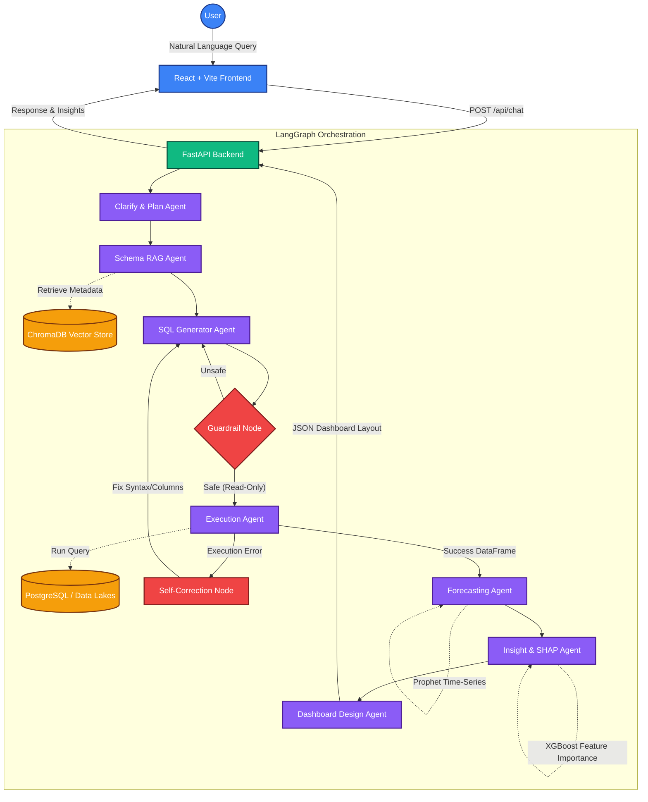

# QueryPilot AI

An advanced, AI-powered Text-to-SQL data analytics platform that allows users to ask natural language questions and instantly receive SQL queries, data visualizations, and automated insights from their connected databases.

##  Key Features
- **Natural Language to SQL**: Talk to your database in plain English. The AI agent automatically understands your schema and generates the exact SQL query required.
- **Automated Insights**: Automatically generates Key Findings, KPI Cards, and detects Statistical Anomalies in your data.
- **Universal Database Support**: Connects seamlessly to PostgreSQL, MySQL, SQL Server, BigQuery, Snowflake, and SQLite.
- **Advanced Visualizations**: Automatically chooses the best chart type (Bar, Line, Pie, etc.) based on the query results.
- **Agentic Workflow**: Uses an intelligent reasoning graph to self-correct SQL syntax errors and validate queries before execution.

 
 

  
## Architecture & Workflow
This project is built using a modern full-stack architecture:
- **Frontend**: React.js powered by Vite, with Lucide Icons and a stunning glassmorphism UI.
- **Backend**: Python FastAPI, utilizing LangChain and LangGraph for the AI agent orchestration.
- **Vector Database**: ChromaDB is used locally to index database schemas, allowing the AI to perfectly understand your table structures.


The Copilot utilizes a multi-agent LangGraph architecture to ensure high accuracy, safety, and self-healing query execution.



# Getting Started

## 1. Backend Setup

Navigate into the backend and start the FastAPI server:

```bash
# Create and activate a virtual environment
python -m venv venv

# On Windows
venv\Scripts\activate

# On macOS/Linux
source venv/bin/activate

# Install dependencies
pip install -r requirements.txt

# Start the backend server
uvicorn backend.main:app --reload
```

### 2. Frontend Setup
Open a new terminal window, navigate to the frontend directory, and start the React app:
```bash
cd frontend
npm install
npm run dev
```

### 3. Usage
1. Open your browser to `http://localhost:5173`.
2. Click **Add Connection** in the sidebar to link your SQL database.
3. Type a question like *"Show me the total revenue by region for the last 6 months"* into the chat!

## ENV
- GROQ API = XXXX 
